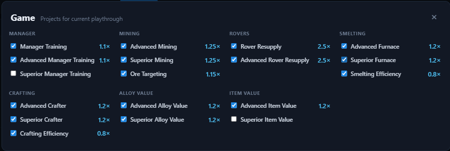

# Game

The **Game** modal lists **projects** for your current playthrough. It is opened with the **Game** button (gamepad icon) in the top bar.

Tick the projects you have completed. Every multiplier in the [Multipliers bar](multipliers.md) and all tables update immediately.

## Projects

Projects are grouped by category. Each checked project applies its multiplier.

### Manager

| Project | Effect |
| --- | --- |
| Manager Training | Manager effects ×1.1 |
| Advanced Manager Training | Manager effects ×1.1 |
| Superior Manager Training | Manager effects ×1.1 |

### Mining

| Project | Effect |
| --- | --- |
| Advanced Mining | Mine speed ×1.25 |
| Superior Mining | Mine speed ×1.25 |
| Ore Targeting | Most valuable ore on each planet +15% mining |
| Advanced Ore Targeting | Most valuable ore on each planet +15% mining |

### Rovers

| Project | Effect |
| --- | --- |
| Rover Resupply | Rover mining ×2.5 |
| Advanced Rover Resupply | Rover mining ×2.5 (total ×5) |

### Smelting

| Project | Effect |
| --- | --- |
| Advanced Furnace | Smelters speed ×1.2 |
| Superior Furnace | Smelters speed ×1.2 |
| Smelting Efficiency | Alloy ingredients ×0.8 |

### Crafting

| Project | Effect |
| --- | --- |
| Advanced Crafter | Crafters speed ×1.2 |
| Superior Crafter | Crafters speed ×1.2 |
| Crafting Efficiency | Item ingredients ×0.8 |

### Alloy Value

| Project | Effect |
| --- | --- |
| Advanced Alloy Value | Alloy value ×1.2 |
| Superior Alloy Value | Alloy value ×1.2 |

### Item Value

| Project | Effect |
| --- | --- |
| Advanced Item Value | Item value ×1.2 |
| Superior Item Value | Item value ×1.2 |

## Notes

- Projects are part of the **temporary** playthrough state — use [Reset](reset.md) to clear them.
- The red dot badge on the **Game** button appears after a reset to remind you the playthrough was cleared.
