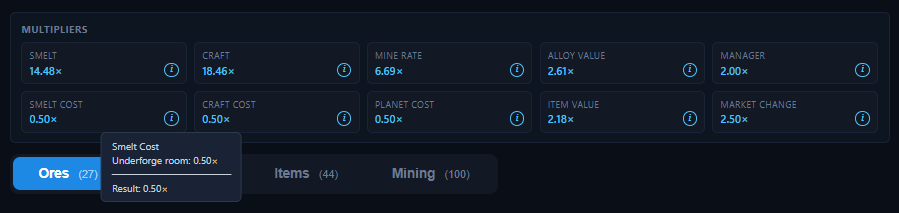

# Multipliers

The **Multipliers** bar sits at the top of the main screen and shows ten summary values. Each reflects your current profile, projects, managers, and market state.

Each value has a small **`i`** info icon — click it to see the tooltip with the full breakdown of every factor and the resulting multiplier. The lists below describe exactly those factors.

> If a value shows `1.00×`, no multiplier is active for it yet.

## The ten values

### Smelt
Smelt speed multiplier, applied to alloy smelt times.
Factors: **Forge room**, **Furnace projects** (Advanced/Superior Furnace), **Smelting stations** 1–5, **manager skill** (All Smelt Speed).

### Smelt Cost
Smelting price modifier (below `1.00×` = cheaper smelting).
Factors: **Underforge room**.

### Craft
Craft speed multiplier, applied to item craft times.
Factors: **Workshop room**, **Crafter projects** (Advanced/Superior Crafter), **Crafting stations** 1–5, **manager skill** (All Craft Speed).

### Craft Cost
Crafting price modifier (below `1.00×` = cheaper crafting).
Factors: **Dorms room**.

### Mine Rate
Mining speed multiplier for ore production.
Factors: **Engineering room**, **Mining projects** (Advanced/Superior Mining), **Mining stations** 1–2, **Global 1.2×** station.
Per planet, the mining rate additionally includes: **beacon**, **colonies**, **probe**, **rover**, **assigned manager**, and **Ore Targeting** projects.

### Planet Cost
Planet upgrade price modifier (below `1.00×` = cheaper upgrades).
Factors: **Astronomy room**.

### Alloy Value
Value multiplier for alloys.
Factors: **Sales room**, **Alloy & Item stations** 1–7, **Alloy value projects** (Advanced/Superior Alloy Value).

### Item Value
Value multiplier for items.
Factors: **Sales room**, **Alloy & Item stations** 1–7, **Item value projects** (Advanced/Superior Item Value).

### Manager
Scales all manager effects.
Factors: **Classroom room**, **Manager Training projects** (Manager Training, Advanced Manager Training, Superior Manager Training).

### Market Change
Boosts positive market changes set in the Supply & Demand panel.
Factors: **Marketing room**.

## Related pages

- Where the underlying levels are set: [Rooms](profile/rooms.md), [Station](profile/station.md), [Beacon](profile/beacon.md), [Managers](profile/managers.md), [Game projects](game.md).
- Where the resulting values are used: [Ores](tabs/ores.md), [Alloys](tabs/alloys.md), [Items](tabs/items.md), [Mining](tabs/mining.md).
