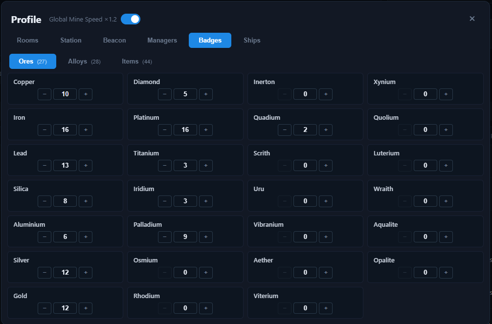

# Profile — Badges

The **Badges** tab lets you set the **star rating** of every ore, alloy, and item in one place. Stars raise a resource's effective price, exactly like the star controls under each resource name on the [Ores](../tabs/ores.md), [Alloys](../tabs/alloys.md), and [Items](../tabs/items.md) tabs.

## Setting stars

- The tab has three sub-categories — **Ores**, **Alloys**, and **Items** — each showing its resources in two columns.
- Use the **− / +** steppers (with [keyboard shortcuts](../README.md#tips)) or type a value directly to set a resource's stars.
- Star ratings are shared with the table star controls — changing a rating here updates it everywhere.

## How badges are used

- Each star increases the resource's effective price (see [Tabs — Effective price](../tabs/README.md#effective-price)).
- The overrides are part of the **temporary** playthrough state — they are cleared by [Reset](../reset.md) and included in [Backup](../backup.md) exports.
