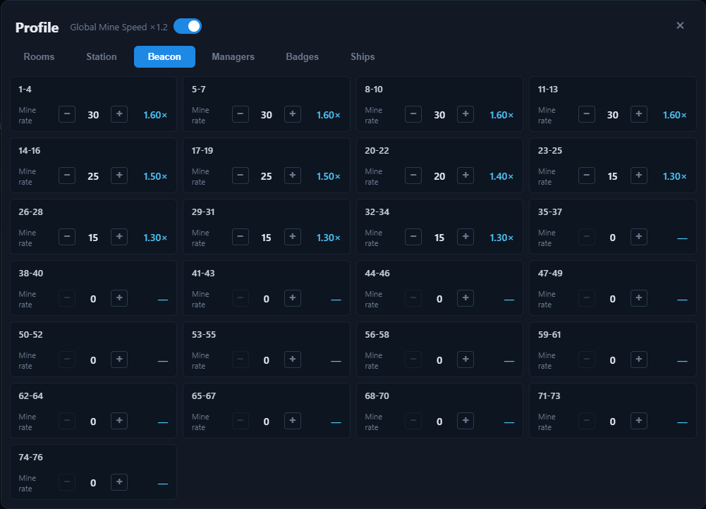

# Profile — Beacon

The **Beacon** tab controls beacon levels for ranges of planets. Each beacon level adds **+2% mining rate** for every planet in that range.

| Beacon | Covers planets | Effect |
| --- | --- | --- |
| 1–4 | Planets 1–4 | +2% per level |
| 5–7 | Planets 5–7 | +2% per level |
| 8–10 | Planets 8–10 | +2% per level |
| 11–13 | Planets 11–13 | +2% per level |
| 14–16 | Planets 14–16 | +2% per level |
| 17–19 | Planets 17–19 | +2% per level |
| 20–22 | Planets 20–22 | +2% per level |
| 23–25 | Planets 23–25 | +2% per level |
| 26–28 | Planets 26–28 | +2% per level |
| 29–31 | Planets 29–31 | +2% per level |
| 32–34 | Planets 32–34 | +2% per level |
| 35–37 | Planets 35–37 | +2% per level |
| 38–40 | Planets 38–40 | +2% per level |
| 41–43 | Planets 41–43 | +2% per level |
| 44–46 | Planets 44–46 | +2% per level |
| 47–49 | Planets 47–49 | +2% per level |
| 50–52 | Planets 50–52 | +2% per level |
| 53–55 | Planets 53–55 | +2% per level |
| 56–58 | Planets 56–58 | +2% per level |
| 59–61 | Planets 59–61 | +2% per level |
| 62–64 | Planets 62–64 | +2% per level |
| 65–67 | Planets 65–67 | +2% per level |
| 68–70 | Planets 68–70 | +2% per level |
| 71–73 | Planets 71–73 | +2% per level |
| 74–76 | Planets 74–76 | +2% per level |

## How beacons are used

The beacon multiplier for a planet is one of the factors in its mining rate, shown in the Mining table's **Rate** tooltip and included in every profit calculation. Because a beacon covers a range of planets, upgrading it raises the rate of all planets in that range at once.

Set the beacon levels to match your in-game beacon upgrades so the app's numbers stay accurate.
