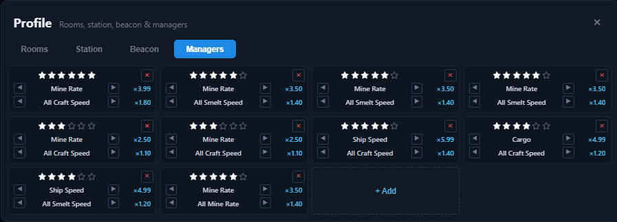

# Profile — Managers

The **Managers** tab lets you define the managers you own. Managers provide global and per-planet bonuses and can be assigned to planets on the [Mining tab](../tabs/mining.md).

## Manager cards

- Click **+ Add** to create a new manager card.
- Click **×** on a card to remove it.
- Each card shows three things: **stars**, the **primary skill**, and the **secondary skill**.

## Stars

- Set a manager's stars (1–7) by clicking the star icons. Hovering shows the value before clicking.
- Stars determine the strength of both skills. The **secondary skill** is locked until the manager has **3 stars**.

## Primary skills

Cycle the primary skill with the **◀ / ▶** buttons:

| Skill | Effect per star tier |
| --- | --- |
| **Mine Rate** | 1.25 → 2.95× mining rate |
| **Ship Speed** | 1.5 → 4.9× |
| **Cargo** | 1.5 → 4.9× |

Managers with the **Mine Rate** primary skill are listed in the **Manager** dropdown on the Mining tab and can be assigned to exactly one planet each.

## Secondary skills (unlocked at 3 stars)

| Skill | Effect (3★ → 7★) |
| --- | --- |
| **All Mine Rate** | 1.05 → 1.5× all planets |
| **All Ship Speed** | 1.1 → 2.0× |
| **All Cargo** | 1.1 → 2.0× |
| **All Craft Speed** | 1.05 → 1.7× |
| **All Smelt Speed** | 1.05 → 1.7× |

## How manager effects are scaled

Every manager effect is scaled by the **Manager** multiplier (Classroom room × Manager Training projects) from the [Multipliers bar](../multipliers.md). The card shows the final effective multiplier for both skills after that scaling.

## Related

- Assigning managers to planets: [Mining tab — Manager column](../tabs/mining.md).
- The **All Craft Speed** and **All Smelt Speed** skills feed the **Craft** and **Smelt** multipliers.
