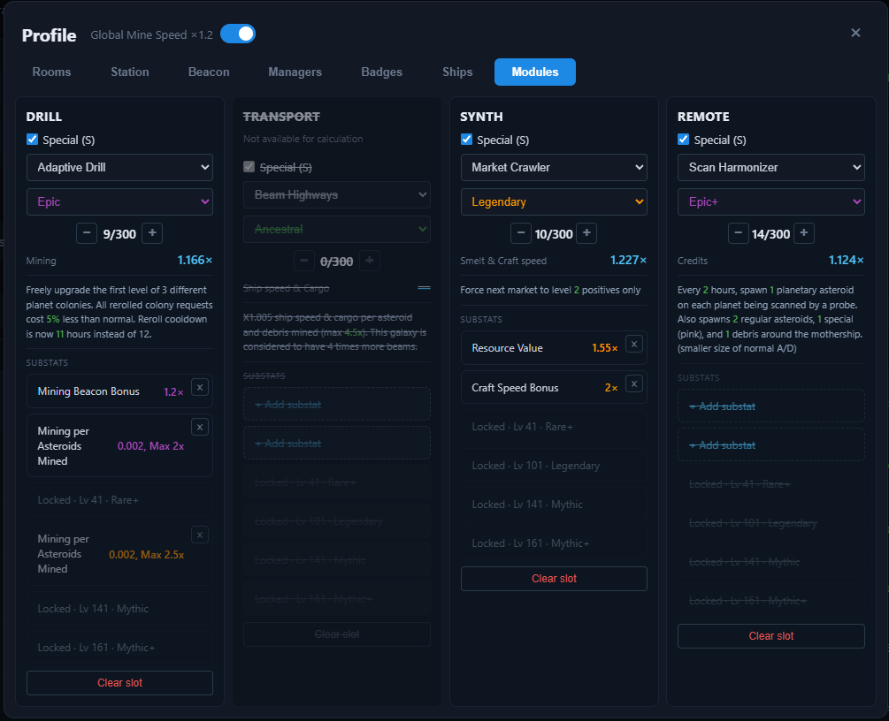
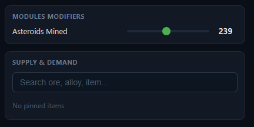

# Modules

The **Modules** tab in the [Profile](README.md) modal holds your module setup. Modules come in four categories — **Drill**, **Transport**, **Synth**, and **Remote** — and the Profile gives you **one slot per category**.



## Slots

Each slot corresponds to one category:

| Slot | Category modules |
| --- | --- |
| **Drill** | Trifact Drill, Adaptive Drill, Exploration Drill, Mercurial Drill |
| **Transport** | Beam Highways, Ark Network, Fleet Consul, Personal Pulse |
| **Synth** | Market Crawler, Burst Injector, Ore Classifier, Incubation Suite |
| **Remote** | Scan Harmonizer, Belt Sonar, Remote Scanner, Probe Dock |

> **Not available for calculation:** the **Transport** slot is currently **fully disabled** — the whole card is greyed out and crossed out, and none of its controls can be used, because its effects are not yet implemented in the calculator. The **Remote** slot *is* selectable (module, rarity, level), but its **substats are disabled** and Remote effects are not wired into the calculator, so nothing on the Remote card changes the numbers. Saved profiles that already reference a Transport/Remote module keep displaying it.

## Special (S) toggle

Every slot has a **Special (S)** checkbox, which is **enabled by default**:

- **Special (S)** — the module is one of the unique modules from the table above. The rarity list is limited to **Epic and above** (Epic, Epic+, Legendary, Legendary+, Mythic, Mythic+, Ancestral), and the slot shows the unique effect text for the selected rarity tier. The values that change with the rarity tier (numbers, percents, multipliers) are highlighted in **green**.
- **Regular** — a generic module without a unique effect. The full rarity scale is available (Common, Rare, Rare+, Epic, Epic+, Legendary, Legendary+, Mythic, Mythic+, Ancestral), and it can be upgraded from Rare.

When you select a new module, the rarity is set automatically — **Epic** for Special modules, **Common** for Regular ones — and the level starts at **1**. (This only applies to the enabled **Drill** and **Synth** slots — see the note above.)

Rarities are color-coded: **Common** gray, **Rare** blue, **Epic** purple, **Legendary** orange, **Mythic** red, **Ancestral** green (a `+` variant uses the color of its base rarity). The rarity picker shows the selected rarity in its color.

## Level

Each slot has its own level, adjusted with the **− / +** steppers (hold `Ctrl`/`Shift` for bigger steps — see [keyboard shortcuts](../README.md)). The maximum level is **300**.

## Base multiplier preview

The slot shows the **base multiplier** for the selected rarity at the current level. The multiplier applies to a different stat depending on the category:

| Slot | Multiplier stat |
| --- | --- |
| **Drill** | Mining |
| **Transport** | Ship speed & Cargo |
| **Synth** | Smelt & Craft speed |
| **Remote** | Credits |

The value comes from the module level table bundled in `public/data/modules.json`:

- Multipliers exist for **Rare and above** (Rare, Rare+, Epic, Epic+, Legendary, Legendary+, Mythic).
- For **Common** there is no data, and **Mythic+ / Ancestral** are not yet verified — for those the preview shows **—**.
- Between recorded levels the value is interpolated; above the highest recorded level the preview shows **—**.

The multiplier preview is informational only — it is **not** yet wired into the [Multipliers bar](../multipliers.md).

> Substats, on the other hand, **are** wired into the calculator — see [Substat effects](#substat-effects) below.

## Substats

Once a module is selected, the slot shows a **Substats** section with a fixed list of **6** slots. Clicking an unlocked slot opens the dialog listing the available substats from the category pool (Drill, Transport, Synth, and Remote each have their own substat list — e.g. Mining Colony Bonus, Ship Speed, Smelt Speed per Beam, Asteroid Frequency).

The first two slots are always available. Each additional slot unlocks when the module reaches a minimum **level** and **rarity**:

| Slot | Requirement |
| --- | --- |
| 1–2 | always available |
| 3 | level **41+** and **Rare or higher** |
| 4 | level **101+** and **Legendary or higher** |
| 5 | level **141+** and **Mythic or higher** |
| 6 | level **161+** and **Mythic+ or higher** |

Locked slots are greyed out and show the requirement (e.g. `Locked · Lv 41 · Rare+`); they become clickable once the level/rarity is met. A locked slot keeps any substat already stored on it — raise the level again to edit or remove it.

- Clicking an unlocked slot opens the dialog; picking an entry sets (or replaces) the substat **at that slot**; a **×** button removes it again.
- Each **rarity variant** of a substat is its own entry in the dialog — e.g. for an Epic module, Mining Colony Bonus appears three times (Common, Rare, Epic), each with its value.
- **Filter bubbles** at the top of the dialog show one rarity at a time — click a bubble to show only that rarity, click it again to show all.
- A **variant already on the list is not offered again** — if e.g. Mining Colony Bonus @ Epic is already selected, the dialog hides that exact variant (Common/Rare variants of the same substat remain available). Substats only apply to the enabled **Drill** and **Synth** slots. The **Transport** card is disabled entirely, and the **Remote** card's substats are disabled (see [Slots](#slots)), so no substats can be added there.
- Only substats that exist **at or below the module's rarity** are shown — e.g. an Epic module won't list substats that only roll at Legendary+, and no variant above the module's rarity is offered.
- Variant values are formatted as:
  - multipliers are shown as `1.07×`,
  - per-unit bonuses are shown as in the sheet (e.g. `0.002, Max 1.45x`),
  - reductions are shown as percentages (e.g. `-2.5%`),
  - if the substat has no value at that rarity, it shows **—**.

## Substat effects

The substats you pick on the enabled **Drill** and **Synth** slots feed into the calculator and change the numbers shown across the app (ore yields, smelt/craft times, alloy/item prices, the [Multipliers bar](../multipliers.md), etc.).

### How values are read

Each substat variant has a numeric value for its rarity. Two shapes are supported:

- **Pure multipliers** (e.g. `1.5`, `2`) — used directly.
- **Capped formulas** written as `0.002, Max 3.35x` or `0.16, max x5 (25)` — the calculator takes the **`Max` cap** as a fixed multiplier (an optimistic approximation, since the per-unit ramp depends on live game state the optimizer doesn't model).

Substats whose value is a string **without** a `Max` cap (e.g. some `Colonization Cost per …` rolls) are displayed but **not** applied — the optimizer has no way to model them.

### What feeds into what

Substats are grouped by key and applied to the matching calculator chain. Substats you've selected whose key is **not** in the lists below are shown on the card but have no effect on results.

| Category | Substat keys applied | Affects |
| --- | --- | --- |
| **Drill** | `mining_colony_bonus`, `mining_beacon_bonus`, `mining_probe_bonus`, `planet_boost_bonus`, `mining_per_asteroids_mined`, `mining_for_each_own_asteroid_mined`, `mining_on_planet_with_10_colonies` | Mining speed → ore yields and the [Ores](../tabs/ores.md) / [Mining](../tabs/mining.md) tabs |
| **Synth** | `smelt_speed_bonus`, `smelt_speed_per_planet_with_colony`, `smelt_speed_per_colony_level`, `smelt_speed_per_beam`, `smelt_speed_of_alloy_for_active_recipie`, `smelt_speed_per_planet_with_10_colonies`, `smelt_speed_per_telescope_with_20_colonies` | Smelt speed → smelt times and the [Alloys](../tabs/alloys.md) tab |
| **Synth** | `craft_speed_bonus`, `craft_speed_per_planet_with_colony`, `craft_speed_per_colony_level`, `craft_speed_per_beam`, `craft_speed_of_item_for_active_recipie`, `craft_speed_per_planet_with_10_colonies`, `craft_speed_per_telescope_with_20_colonies` | Craft speed → craft times and the [Items](../tabs/items.md) tab |
| **Synth** | `resource_value` (applies to ores, alloys, and items), `market_bonus`, `market_bonus_per_planet_with_colony`, `market_bonus_per_beam` | Effective price of all ores, alloys, and items |
| **Synth** | `alloy_value` | Effective price of alloys only |
| **Synth** | `item_value` | Effective price of items only |

### How they combine

All contributing substats from a category are **multiplied together**, and the product is then multiplied into the relevant aggregate (mining speed, smelt speed, craft speed, or effective price) — the same pattern used for rooms, station, projects, ships, and managers. A category with no contributing substats changes nothing.

## Modules Modifiers panel

Some substats don't have a fixed multiplier — their effect **scales with a count you provide** (e.g. *Mining bonus per asteroid mined*, *Smelt speed per beam*, *per colony level*). For those, the app shows a **Modules Modifiers** panel in the right-hand column (next to [Supply & Demand](../supply-and-demand.md)), above the tabs.



The panel only appears once you have selected a *per-X* substat on a **Drill** or **Synth** slot (per-X substats on the disabled **Remote** slot never show up — see [Slots](#slots)). For each active per-X dependency it draws one row:

- A small **− / +** stepper when the maximum count is low, or a **slider** when the maximum is high.
- You set the count **X** (e.g. how many asteroids you've mined, how many beams you have).

That count is fed into the substat's effect as:

```
multiplier = min(1 + X × perUnit, max)
```

where `perUnit` and `max` come from the substat's value string (e.g. `0.3, max 3.5x (9)` → `perUnit = 0.3`, `max = 3.5`). With **X = 0** the substat is skipped and contributes nothing. This is the third substat value shape, alongside the flat multipliers and the `Max`-capped formulas described in [How values are read](#how-values-are-read).

### Per-X dependencies

Several substats can share one counter (the same **X** drives all of them). The panel shows one row per active dependency:

| Counter (label) | Substat keys | Category |
| --- | --- | --- |
| **Asteroids Mined** | `mining_per_asteroids_mined` | Drill |
| **Own Asteroids Mined** | `mining_for_each_own_asteroid_mined` | Drill |
| **Beams** | `smelt_speed_per_beam`, `craft_speed_per_beam`, `market_bonus_per_beam` | Synth |
| **Active Recipes (same type)** | `smelt_speed_of_alloy_for_active_recipie`, `craft_speed_of_item_for_active_recipie` | Synth |
| **Planets with Colony** | `smelt_speed_per_planet_with_colony`, `craft_speed_per_planet_with_colony`, `market_bonus_per_planet_with_colony` | Synth |
| **Total Colony Levels** | `smelt_speed_per_colony_level`, `craft_speed_per_colony_level` | Synth |
| **Planets with ≥10 Colonies** | `smelt_speed_per_planet_with_10_colonies`, `craft_speed_per_planet_with_10_colonies` | Synth |
| **Telescopes with ≥20 Colonies** | `smelt_speed_per_telescope_with_20_colonies`, `craft_speed_per_telescope_with_20_colonies` | Synth |
| **Colonies in Galaxy (/10)** | `credit_multi_per_colonies_10_in_galaxy` | Remote *(inert — Remote substats are disabled, so this row never appears)* |
