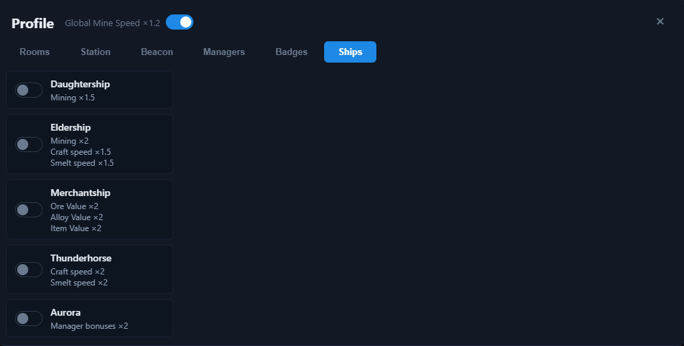

# Profile — Ships

The **Ships** tab lists the five ships you can own. Each ship is a simple **on/off toggle** — own it or not. Owning a ship applies its bonuses to the [Multipliers bar](../multipliers.md) and every table in the app.

| Ship | Bonuses |
| --- | --- |
| **Daughtership** | Mining ×1.5 |
| **Eldership** | Mining ×2.0, Craft speed ×1.5, Smelt speed ×1.5 |
| **Merchantship** | Ore Value ×2.0, Alloy Value ×2.0, Item Value ×2.0 |
| **Thunderhorse** | Craft speed ×2.0, Smelt speed ×2.0 |
| **Aurora** | Manager bonuses ×2.0 |

## How ships are used

- Toggle a ship **on** to mark it as owned; its bonuses multiply the corresponding multipliers immediately.
- **Mining** bonuses feed the **Mine Rate** multiplier and each planet's rate on the [Mining tab](../tabs/mining.md).
- **Craft speed** and **Smelt speed** feed the **Craft** and **Smelt** multipliers.
- **Ore / Alloy / Item Value** feed the value multipliers that raise the effective prices used across the app.
- **Manager bonuses** scale all manager effects (see the **Manager** multiplier).

## Related

- See each ship's effect in the multiplier tooltips: [Multipliers bar](../multipliers.md).
- Ships are part of the persistent profile — they are saved in `localStorage` and included in [Backup](../backup.md) exports.
