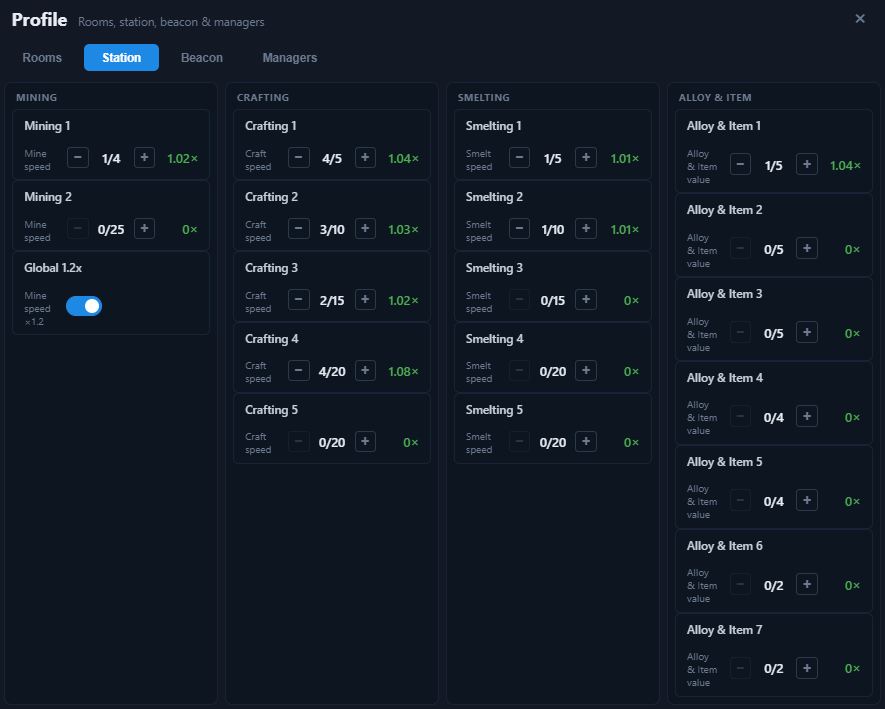

# Profile — Station

The **Station** tab holds the levels of all station groups. Station levels stack to produce the speed and value multipliers used across the app.

## Mining

| Station | Effect | Per level | Max level |
| --- | --- | --- | --- |
| Mining 1 | Mine speed | +0.02 | 4 |
| Mining 2 | Mine speed | +0.10 | 25 |
| Global 1.2× | Mine speed ×1.2 | toggle | — |

## Crafting

| Station | Effect | Per level | Max level |
| --- | --- | --- | --- |
| Crafting 1 | Craft speed | +0.01 | 5 |
| Crafting 2 | Craft speed | +0.01 | 10 |
| Crafting 3 | Craft speed | +0.01 | 15 |
| Crafting 4 | Craft speed | +0.02 | 20 |
| Crafting 5 | Craft speed | +0.04 | 20 |

## Smelting

| Station | Effect | Per level | Max level |
| --- | --- | --- | --- |
| Smelting 1 | Smelt speed | +0.01 | 5 |
| Smelting 2 | Smelt speed | +0.01 | 10 |
| Smelting 3 | Smelt speed | +0.01 | 15 |
| Smelting 4 | Smelt speed | +0.02 | 20 |
| Smelting 5 | Smelt speed | +0.04 | 20 |

## Alloy & Item

| Station | Effect | Per level | Max level |
| --- | --- | --- | --- |
| Alloy & Item 1 | Alloy/Item value | +0.036 | 5 |
| Alloy & Item 2 | Alloy/Item value | +0.08 | 5 |
| Alloy & Item 3 | Alloy/Item value | +0.08 | 5 |
| Alloy & Item 4 | Alloy/Item value | +0.02 | 4 |
| Alloy & Item 5 | Alloy/Item value | +0.02 | 4 |
| Alloy & Item 6 | Alloy/Item value | +0.075 | 2 |
| Alloy & Item 7 | Alloy/Item value | +0.075 | 2 |

## How stations combine

- **Craft speed** = product of the active Crafting 1–5 station multipliers, combined with the Workshop room and craft projects.
- **Smelt speed** = product of the active Smelting 1–5 station multipliers, combined with the Forge room and smelt projects.
- **Mine speed** = product of Mining 1, Mining 2, and the Global 1.2× toggle, combined with the Engineering room and mining projects.
- **Alloy/Item value** = product of the Alloy & Item 1–7 station multipliers, combined with the Sales room and value projects.

Each station shows its current multiplier next to the level control. Turned off stations contribute nothing.
