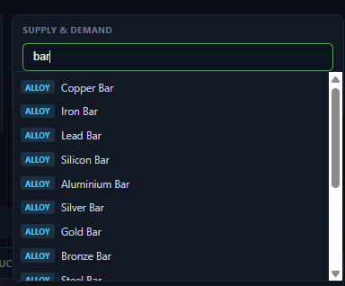
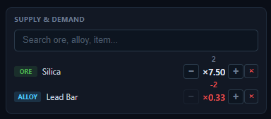

# Supply & Demand

The **Supply & Demand** panel sits next to the Multipliers bar. It lets you set the **current market change** of any resource — ore, alloy, or item. These overrides feed the **effective price** used by every table in the app.

## Pinning a resource

1. Type in the search box to find a resource by name (e.g. `copper`, `steel_bar`, `laser`). While typing, the matching results appear in a list below the search box.
2. Click a result to **pin** it. A ✓ appears next to pinned results, and the resource moves into the list below.

Search matches ores, alloys, and items, each shown with a colored type badge (Ore, Alloy, Item).

## Setting the market change

Each pinned resource has **− / +** buttons. The market change ranges from **−2 to +4**, which maps to these effective multipliers:

| Change | −2 | −1 | 0 | +1 | +2 | +3 | +4 |
| --- | --- | --- | --- | --- | --- | --- | --- |
| Multiplier | ×0.33 | ×0.5 | ×1 | ×2 | ×3 | ×4 | ×5 |

- The raw market-change label (e.g. `+2`) is shown above the multiplier.
- The effective multiplier includes the **Marketing room** boost from the [Multipliers bar](multipliers.md), so positive changes can go higher than the raw table above.
- The effective multiplier turns **red** when it drops below ×1.

## Removing a resource

Click **×** on a pinned row to remove it. Its market change resets to the default (×1).

## How it affects the app

The market override is one of the factors in each resource's **effective price**, which drives:

- **Material costs** in the [Alloys](tabs/alloys.md) and [Items](tabs/items.md) tables
- **Profit per craft** and **profit per second**
- **Mining profit** and ore targeting decisions in [Ores](tabs/ores.md) and [Mining](tabs/mining.md)

Change the market here and every table updates immediately.

## Related

- Market overrides are **temporary** and cleared by [Reset](reset.md).
- They are included in [Backup](backup.md) exports.
