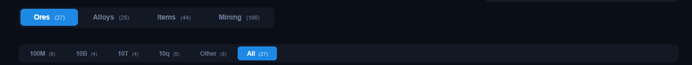

# Tabs

The main tables of the app live in tabs below the Multipliers bar: **Ores**, **Alloys**, **Items**, **Mining**, **Milestones**, and **Credits**. Each tab shows its entry count next to its name.

## Shared concepts

All four tabs are built around a few common ideas.

### Effective price

The **effective price** of a resource is its base game price adjusted by:

- **Star ratings** (set under each resource name)
- **Market change** (set in the [Supply & Demand panel](../supply-and-demand.md))
- **Value multipliers** (Sales room, Alloy & Item stations, value projects)

Almost every profit number in the app is computed from effective prices, not base prices.

### Group filters

Each table has filter tabs that group entries by price tier — typically **100M**, **10B**, **10T**, **10q**, **Other**, plus **All**. Each tab shows how many entries it contains. The Ores and Mining tables group by ore/planet tier, while Alloys and Items group by product price.

### Star ratings

Every ore, alloy, and item has a star rating control under its name. Use **− / +** buttons or type a value directly. Stars increase the resource's effective price.

### Highlights

While a filter group is active:

- **Best in group** (green row) — the highest profit per second within the current group.
- **Best from previous group** (blue row) — the best entry from the previous price tier, shown at the top of the current group for comparison.

### Keyboard shortcuts

Hold a modifier key while clicking a **± stepper** (star ratings, mining levels, colonies):

| Modifier | Step |
| --- | --- |
| *(none)* | +1 |
| `Ctrl` | +5 |
| `Shift` | +10 |
| `Ctrl` + `Shift` | +50 |

You can also type directly into most number inputs.

## The tabs

| Tab | Page |
| --- | --- |
| Ores — mineable resources and mining profit | [Ores](ores.md) |
| Alloys — smelted bars and alloys | [Alloys](alloys.md) |
| Items — crafted items | [Items](items.md) |
| Mining — planets, session planning, and the roadmap | [Mining](mining.md) |
| Credits — milestone rewards tracker per run | [Credits](credits.md) |
