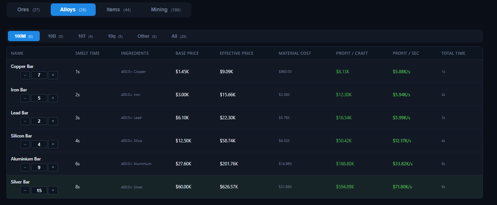
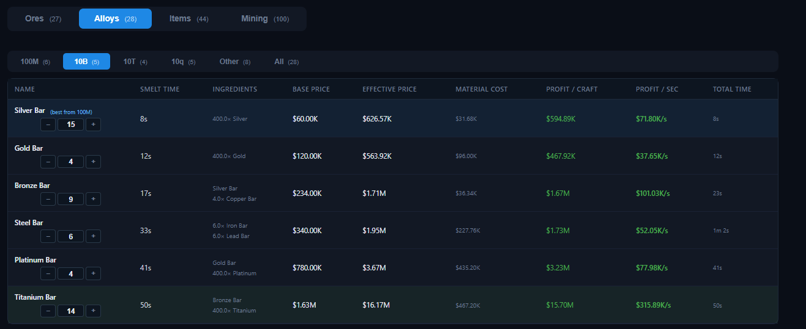

# Tabs — Alloys

The **Alloys** tab lists every smelted bar and alloy and ranks them by profitability.

## Columns

| Column | Meaning |
| --- | --- |
| **Name** | Alloy name and star rating. |
| **Smelt Time** | Base smelt time divided by your smelt speed multiplier. |
| **Ingredients** | Required ores/items and quantities (adjusted for the **Smelting Efficiency** project). |
| **Base Price** | The alloy's base game price. |
| **Effective Price** | Base price adjusted for stars, market override, and value multipliers. |
| **Material Cost** | The total effective value of all ingredients. |
| **Profit / Craft** | Effective price − material cost (green when positive, red when negative). |
| **Profit / sec** | Profit per craft divided by smelt time. |
| **Total Time** | Full production time for the recipe. |

## Group filters & highlights

Alloys are grouped by product price tier (**100M**, **10B**, **10T**, **10q**, **Other**) with an **All** option.

- **Best in group** (green) — the alloy with the highest profit per second in the current group.
- **Best from previous group** (blue) — the best alloy from the previous tier, shown at the top for comparison.

## Notes

- **Smelt Time** and **Profit / sec** react to everything in the [Smelt multiplier](../multipliers.md): Forge room, Furnace projects, Smelting stations, and the All Smelt Speed manager skill.
- **Material Cost** uses effective prices, so changing a star rating, market override, or value multiplier re-ranks the table automatically.
