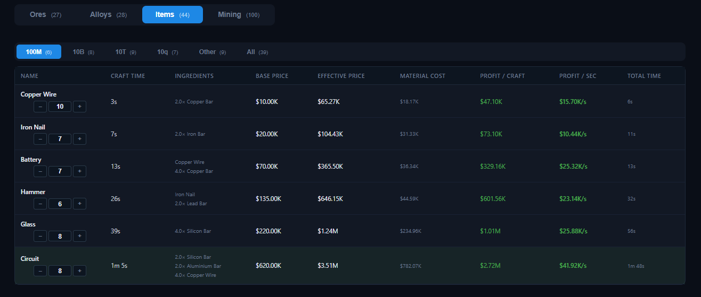
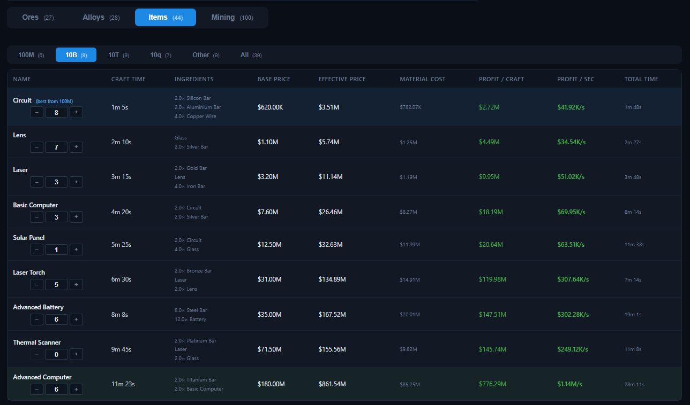

# Tabs — Items

The **Items** tab lists every crafted item and ranks them by profitability.

## Columns

| Column | Meaning |
| --- | --- |
| **Name** | Item name and star rating. |
| **Craft Time** | Base craft time adjusted by your craft speed multiplier and the production tree. |
| **Ingredients** | Required ingredients and quantities (adjusted for the **Crafting Efficiency** project). |
| **Base Price** | The item's base game price. |
| **Effective Price** | Base price adjusted for stars, market override, and value multipliers. |
| **Material Cost** | The total effective value of all ingredients. |
| **Profit / Craft** | Effective price − material cost (green when positive, red when negative). |
| **Profit / sec** | Profit per craft divided by craft time. |
| **Total Time** | Full production time for the recipe, including all sub-recipes. |

## Group filters & highlights

Items are grouped by product price tier (**100M**, **10B**, **10T**, **10q**, **Other**) with an **All** option.

- **Best in group** (green) — the item with the highest profit per second in the current group.
- **Best from previous group** (blue) — the best item from the previous tier, shown at the top for comparison.

## Notes

- Items are often built from alloys, so the table computes the full production chain: ingredient quantities, material costs, and total time include every sub-step.
- **Craft Time** and **Profit / sec** react to everything in the [Craft multiplier](../multipliers.md): Workshop room, Crafter projects, Crafting stations, and the All Craft Speed manager skill.
- **Material Cost** uses effective prices, so the ranking updates automatically when you change stars, market overrides, or value multipliers.
