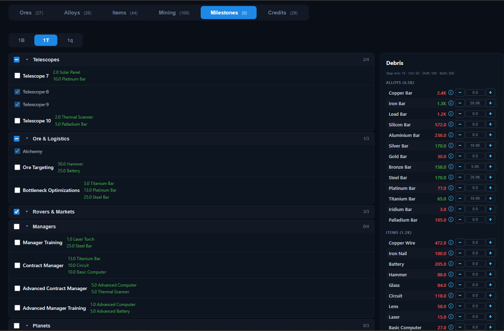

# Tabs — Milestones

The **Milestones** tab lists the projects tied to each galaxy-value milestone and helps you plan the "debris" (alloys and items) you'll need to build them. It is the planning companion to the [Game](../../game.md) projects — here you track progress per milestone tier and tally what's left to craft.

## Milestone tiers

A row of tabs across the top switches between milestone tiers (by galaxy value, e.g. `1B`, `10B`, `100B`, …). The first tier is selected by default. Each tier has its own set of projects; your checkmarks and owned amounts are tracked **per tier**.

## Projects (left)

Projects for the selected tier are grouped into collapsible categories — **Basic, Telescopes, Ore Logistics, Asteroids, Rovers, Managers, Planets, Production**. Each group header shows:

- a **checkbox** to toggle *all* projects in the group at once (with an indeterminate state when only some are done),
- a **collapse/expand** arrow,
- a **done / total** count.

Each project row has a checkbox to mark it complete. Completed projects are struck through and their cost list is hidden. Incomplete projects show their cost as a list of resources (ore / alloy / item names), each quantity adjusted by your **Laboratory** room multiplier (`ceil(qty × labMod)`), so the displayed amounts already reflect that bonus.

When every project in a group is done, the group auto-collapses.

## Debris panel (right)

The right-hand **Debris** panel aggregates everything still required by the *incomplete* projects of the current tier — the raw materials you'll have to mine or craft. It is split into **Alloys** and **Items** sections; within each, resources are sorted by base price.

- **Quantity needed** is shown per resource, color-coded by how much you've marked as owned:
  - green — you own enough,
  - orange — you own some but not all,
  - red — you own none yet.
- An **`i`** icon next to a resource opens a tooltip breaking down where the quantity comes from — listed per **project** (direct) and per **item it's crafted from** (via items).
- The **Owned** field lets you record how many you already have. Use the **− / +** buttons, or type a value directly. Steppers respect the same modifier-key shortcuts as elsewhere, scaled to debris:
  - *(none)* → **1K**, `Ctrl` → **5K**, `Shift` → **10K**, `Ctrl`+`Shift` → **50K**.
- When all projects in the tier are complete, the panel shows **"All projects complete!"**.

> Both the project checkmarks and the owned amounts are saved automatically as part of your run state (alongside [Game](../../game.md) projects) and persist in `localStorage`.

## Relationship to other tabs

The Milestones tab plans the *inputs*; the [Items](../items.md) and [Alloys](../alloys.md) tabs show the crafting/smelting profit for producing that debris, and the [Mining](../mining.md) tab covers the ore side. The [Credits](../credits.md) tab shows the credit reward you earn by reaching each milestone's galaxy value.
