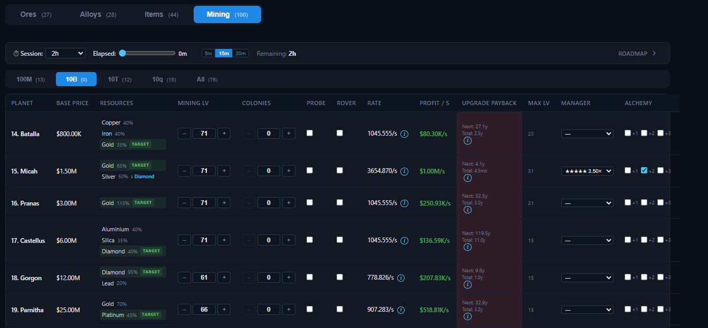
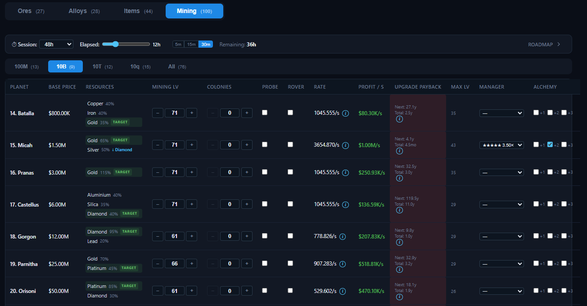
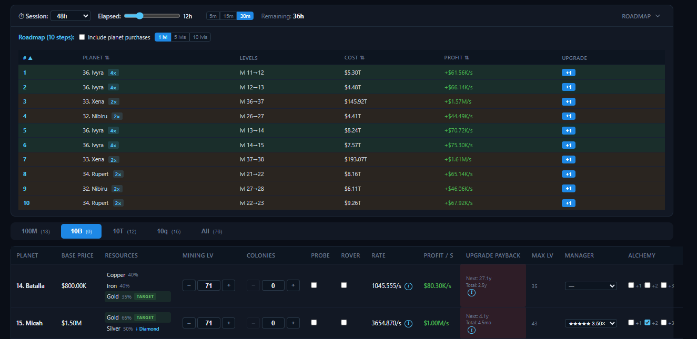

# Tabs — Mining

The **Mining** tab is the most powerful view. It shows every planet, lets you configure its mining setup, and computes rates, profits, paybacks, and a recommended upgrade plan.

## Planet table

The table has a filter bar (price groups such as **100M / 10B / 10T / 10q**, or **All**) and one row per planet:

| Column | Meaning |
| --- | --- |
| **Planet** | Planet number and name. |
| **Base Price** | Planet purchase price. |
| **Resources** | The ores on this planet and their yields. With **Ore Targeting** enabled ([Game projects](../game.md)), each resource becomes clickable — click one to target it (marked **TARGET**); the app auto-targets the most valuable ore when none is chosen. Alchemy upgrades show a `↓ next-ore` hint. |
| **Mining Lv** | Mining level (0–100). Use **− / +** steppers (with [keyboard shortcuts](README.md#keyboard-shortcuts)) or type a value. |
| **Colonies** | Number of colonies (0–100). Each colony adds +30% mining rate. |
| **Probe** | Checkbox to enable a probe, plus a multiplier field for its speed. |
| **Rover** | Checkbox to enable a rover (multiplied by the Rover Resupply projects). |
| **Rate** | Current mining rate (`/s`). The `i` tooltip shows every factor: base level rate, Engineering room, projects, stations, Global 1.2×, beacon, colonies, probe, rover, ore targeting. |
| **Profit / s** | Rate × weighted ore value (using effective prices). |
| **Upgrade Payback** | Time for the next level to pay for itself ("Next"), plus total payback for the whole planet ("Total"). The `i` tooltip projects payback for **+1 / +5 / +10** levels and shows total invested. |
| **Max Lv** | Highest level that pays back within the current session — click it to apply. Shows `—` when there is no profitable upgrade or no session set. |
| **Manager** | Assign a mining manager (those with the **Mine Rate** primary skill, see [Managers](../profile/managers.md)). A manager can only be assigned to one planet. |
| **Alchemy** | Enable **+1 / +2 / +3** alchemy and choose which ore to upgrade (each upgrade moves the ore to the next ore tier). Only one planet can use the same alchemy level. |

## Session panel

At the top of the tab there is a collapsible **Session** panel used to plan upgrades for a single play session:

- **Session** — pick a duration from **30m** up to **48h**, or **Custom** to enter your own. In the example above a **48h** tournament session is selected.
- **Elapsed** — a slider showing how much of the session has already passed, with quick **5m / 15m / 30m** step buttons. In the example, **12h** have elapsed.
- **Remaining** — the session time left, shown to the right (48h − 12h = **36h** in the example).

The session drives two things:

- **Upgrade Payback** coloring — green when the payback fits inside the remaining session, yellow when it is close, red when it does not fit.
- **Max Lv** — the highest mining level whose upgrade pays back within the session. **Click the Max Lv value** to set the planet to that calculated level instantly.

### Roadmap

Open the panel body (click the **Roadmap** toggle) to see an ordered **Roadmap** of the most profitable mining upgrades for your current session.

The roadmap ranks the top **10 upgrades** by the ratio of upgrade **cost** to the resulting **profit gain per second** — the best payback for the invested money.

- **Include planet purchases** — include buying planets that are not yet owned.
- **Step size** — plan upgrades in **1**, **5**, or **10** level steps. The cost and profit columns adjust accordingly.
- **Sorting** — the **#**, **Planet**, **Cost**, and **Profit** columns are sortable by clicking the header; click again to reverse the order.
- Each step shows the planet, the level change (`lvl X→Y`), the upgrade cost, and the profit gained per second.
- Click **Upgrade** on a step to apply it — the planet's mining level in the table is increased immediately.
- Rows that upgrade the same planet repeatedly are color-coded (orange = 2×, yellow = 3×, green = more) to show that a single planet keeps being the best buy.

## Tips

- Mining rate combines: `baseRate(lvl) × mine-rate multipliers × beacon × (1 + 0.3 × colonies) × probe × rover × manager`.
- If a planet has no mining level yet, its rate and profit are zero until you buy and upgrade it.
- Use the roadmap's **Upgrade** button to apply the best step directly, then re-check paybacks — the roadmap recomputes instantly.
