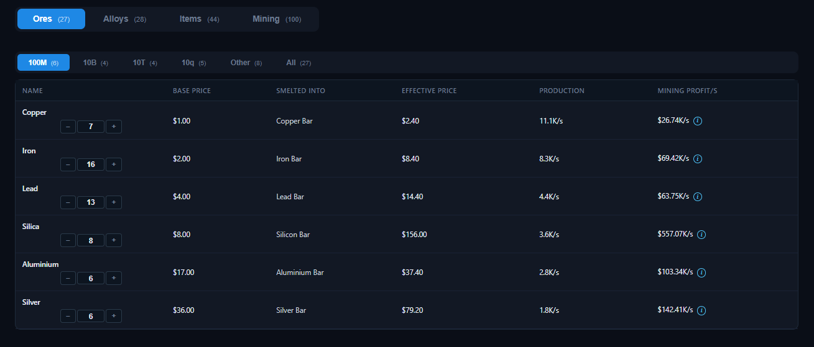
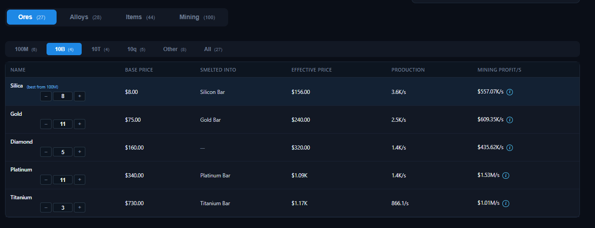

# Tabs — Ores

The **Ores** tab lists every mineable ore and shows how much each one earns per second across all planets.

## Columns

| Column | Meaning |
| --- | --- |
| **Name** | Ore name and star rating. |
| **Base Price** | The ore's base game price. |
| **Smelted Into** | Which alloy this ore smelts into (or `—`). |
| **Effective Price** | Base price adjusted for stars, market override, and the Marketing room. |
| **Production** | Total mining rate for this ore across all planets (`/s`). |
| **Mining Profit/s** | Production × effective price. The `i` tooltip breaks the number down per planet, showing each planet's ore rate, effective price, and contribution. |

## Group filters

Ores are grouped by price tier (**100M**, **10B**, **10T**, **10q**, **Other**) with an **All** option. Each group shows its entry count.

## Highlights

While a group is selected, the **best ore from the previous group** (by mining profit per second) is highlighted in blue and pinned to the top for comparison, labeled `(best from <group>)`.

## Notes

- Ore **Production** is aggregated from every planet that mines the ore. It depends on the mining level, colonies, probes, rovers, beacons, and managers you set on the [Mining tab](mining.md).
- With **Ore Targeting** / **Advanced Ore Targeting** enabled ([Game projects](../game.md)), the most valuable ore on each planet receives +15% mining per project — this is reflected in the Production and tooltip numbers.
